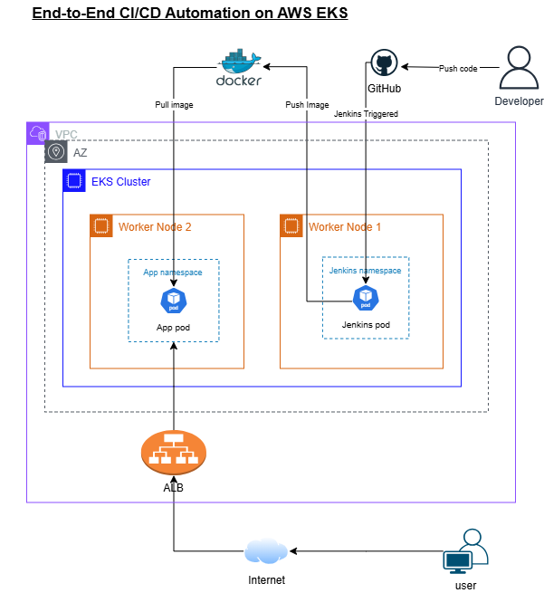

# DEPI Graduation Project: URL Shortener on AWS EKS

Welcome to the DEPI Graduation Project! This repository contains a fully functional URL shortener service deployed on AWS EKS. It demonstrates modern DevOps practices including containerization, CI/CD pipelines, cloud-native architecture, and automated deployments.

The project provides a simple, reliable, and scalable URL shortening service built with Flask, backed by SQLite, and deployed in a Kubernetes environment on AWS. It is designed for learning cloud infrastructure concepts, CI/CD automation, and scalable application deployment.

## What Makes This Special

Imagine turning long, unwieldy URLs into short, shareable links with just a click. Our application does exactly that, while demonstrating enterprise-grade deployment practices. Here's what sets it apart:

- **Smart URL Shortening**: Uses MD5 hashing with collision avoidance for unique, short codes
- **Persistent Storage**: SQLite database with Docker volume persistence
- **Web Interface**: Beautiful, responsive UI with real-time stats and recent links
- **Cloud-Native**: Fully containerized and orchestrated on AWS EKS
- **Automated Pipelines**: Jenkins CI/CD with Kaniko for secure, daemon-less builds
- **Security First**: RBAC, namespace isolation, and least-privilege access
- **Monitoring Ready**: Built-in health checks and logging

## Architecture at a Glance

We've structured this project to follow best practices for cloud applications, keeping things organized and scalable:

```

┌─────────────────┐    ┌─────────────────┐    ┌─────────────────┐
│   GitHub Repo   │ -> │     Jenkins     │ -> │     AWS EKS     │
│                 │    │   (CI/CD)       │    │   (Production)  │
└─────────────────┘    └─────────────────┘    └─────────────────┘
         │                       │                       │
         └───────────────────────┼───────────────────────┘
                                 │
                    ┌─────────────────┐
                    │   URL Shortener │
                    │    (Flask App)  │
                    └─────────────────┘
```

<p align="center">
  
</p>

Key Components:
- AWS Infrastructure: Includes a VPC, EKS cluster with separate node groups for Jenkins and the app, plus EBS for storage.
- Kubernetes: Uses isolated namespaces (app-ns and jenkins-ns) with role-based access control for security.
- Application: A Flask-based API with SQLite for data storage, exposed through a LoadBalancer service.
- CI/CD: Jenkins automates builds using Kaniko and deploys updates to the cluster.

## Project Structure

```
.
├── app/                          # Flask application
│   ├── app.py                    # Main Flask app with API endpoints
│   ├── Dockerfile                # Container build instructions
│   ├── index.html                # Web UI
│   ├── requirements.txt          # Python dependencies
│   └── static/                   # Static assets (images, etc.)
│
├── terraform/                    # Infrastructure as Code
│   ├── main.tf                   # Main Terraform configuration
│   ├── variables.tf              # Input variables
│   ├── outputs.tf                # Output values
│   ├── providers.tf              # Provider configurations
│   └── modules/                  # Reusable Terraform modules
│       ├── vpc/                  # VPC setup
│       ├── security-groups/      # Security group rules
│       ├── iam/                  # IAM roles and policies
│       ├── eks/                  # EKS cluster configuration
│       └── ebs-csi/              # EBS storage driver
│
├── kubernetes/                   # Kubernetes manifests
│   ├── namespaces/               # Namespace definitions
│   │   ├── app-namespace.yaml
│   │   └── jenkins-namespace.yaml
│   ├── jenkins/                  # Jenkins deployment files
│   │   ├── storageclass-ebs.yaml
│   │   ├── jenkins-pvc.yaml
│   │   ├── jenkins-sa.yaml
│   │   ├── jenkins-role-*.yaml
│   │   ├── jenkins-deployment.yaml
│   │   └── jenkins-service.yaml
│   └── app/                      # Application deployment
│       ├── app-deployment.yaml
│       └── app-service.yaml
│
├── Jenkinsfile                   # CI/CD pipeline definition
├── README.md                     # This file
└── .gitignore                    # Git ignore rules
```

## What You'll Need

Before getting started, make sure you have these prerequisites in place:

Prerequisites:
- AWS Account: Needs permissions for EKS, EC2, VPC, IAM, and EBS services.
- Tools:
  - Terraform version 1.0 or higher
  - kubectl configured to connect to your EKS cluster
  - AWS CLI with your credentials set up
  - Docker for testing locally
  - Git for version control
- Knowledge: A basic understanding of AWS, Kubernetes, and CI/CD will help.
- Resources: Ensure your AWS account has enough limits; we use t3.small instances.

## Step-by-Step Setup Guide

Let's get you up and running! We'll go through infrastructure setup, Kubernetes deployment, and CI/CD configuration.

### Step 1: Infrastructure Provisioning with Terraform

The first step is to set up the AWS infrastructure that will host our application. Terraform will create all the necessary resources in a repeatable way.

Navigate to the terraform directory and run these commands:

```bash
cd terraform

# Initialize Terraform modules
terraform init

# Review what will be created
terraform plan

# Deploy the infrastructure
terraform apply
```

This will create:
- A VPC with public subnets spread across two availability zones for high availability.
- An EKS cluster with a control plane to manage the Kubernetes environment.
- Two managed node groups: one for Jenkins (jenkins-ng) and one for the application (app-ng), each with t3.small instances.
- Security groups to control network access.
- IAM roles for the necessary permissions.
- The EBS CSI driver to allow persistent storage for our application data.

### Step 2: Connect to Your EKS Cluster

Now let's configure kubectl to talk to your new cluster:

```bash
# Update kubeconfig (replace with your region and cluster name)
aws eks update-kubeconfig --region us-west-2 --name depi-graduation
```

Verify connection:
```bash
kubectl get nodes
```

### Step 3: Deploy Kubernetes Namespaces

Kubernetes namespaces help organize and isolate resources. We'll create separate namespaces for Jenkins and the application to keep things secure and organized.

Change to the namespaces directory and apply the YAML files:

```bash
cd ../kubernetes/namespaces

# Deploy both namespaces
kubectl apply -f app-namespace.yaml
kubectl apply -f jenkins-namespace.yaml
```

This sets up 'app-ns' for the URL shortener app and 'jenkins-ns' for the CI/CD tools.

### Step 4: Deploy Jenkins

Time to set up our CI/CD powerhouse:

```bash
cd ../jenkins

# Deploy in this order:
kubectl apply -f storageclass-ebs.yaml
kubectl apply -f jenkins-pvc.yaml
kubectl apply -f jenkins-sa.yaml
kubectl apply -f jenkins-role-app-deployment.yaml
kubectl apply -f jenkins-rolebinding-app-deployment.yaml
kubectl apply -f jenkins-role-pod-management.yaml
kubectl apply -f jenkins-rolebinding-pod-management.yaml
kubectl apply -f jenkins-deployment.yaml
kubectl apply -f jenkins-service.yaml
```

Wait for Jenkins to be ready:
```bash
kubectl rollout status deployment/jenkins-deployment -n jenkins-ns
```

### Step 5: Access Jenkins

Once Jenkins is running, you need to access its web interface to configure it.

First, find the external IP address of the Jenkins service:

```bash
# Get Jenkins URL
kubectl get svc jenkins-service -n jenkins-ns
```

Look for the EXTERNAL-IP in the output. Then, retrieve the initial admin password from the Jenkins pod:

```bash
# Retrieve admin password
JENKINS_POD=$(kubectl get pods -n jenkins-ns -o jsonpath='{.items[0].metadata.name}')
kubectl exec -n jenkins-ns $JENKINS_POD -- cat /var/jenkins_home/secrets/initialAdminPassword
```

Open your browser and go to `http://<EXTERNAL-IP>:8080`. Use 'admin' as the username and the password you just retrieved. Follow the setup wizard to install suggested plugins and create an admin user.

### Step 6: Configure Jenkins for Kubernetes

Set up Jenkins to deploy to your EKS cluster:

1. **Install Plugins**:
   - Go to Manage Jenkins → Manage Plugins
   - Install: Kubernetes, Pipeline

2. **Add DockerHub Credentials**:
   - Manage Jenkins → Manage Credentials
   - Add credentials: `dockerhub-credentials`
   - Username: Your DockerHub username
   - Password: Your DockerHub access token

3. **Configure Kubernetes Cloud**:
   - Manage Jenkins → Manage Nodes and Clouds → Configure Clouds
   - Add new Kubernetes cloud:
     - **URL**: `https://kubernetes.default.svc.cluster.local`
     - **Namespace**: `jenkins-ns`
     - **Jenkins URL**: `http://jenkins-service.jenkins-ns.svc.cluster.local:8080`
     - **Tunnel**: `jenkins-service.jenkins-ns.svc.cluster.local:50000`
   - Test connection

### Step 7: Create the CI/CD Pipeline

Let's create the pipeline that will automate your deployments:

1. **New Pipeline Job**:
   - Name: `url-shortener-app`
   - Type: Pipeline

2. **Configure Pipeline**:
   - Definition: Pipeline script from SCM
   - SCM: Git
   - Repository URL: Your GitHub repo URL
   - Branch: `main`
   - Script Path: `Jenkinsfile`

3. **Save and Build**

### Step 7.5: Configure GitHub Webhooks

To automate the CI/CD pipeline on every push to the repository, configure GitHub webhooks to trigger Jenkins builds:

1. **In GitHub Repository**:
   - Go to your repository on GitHub
   - Navigate to Settings → Webhooks
   - Click "Add webhook"
   - **Payload URL**: `http://<JENKINS-EXTERNAL-IP>:8080/github-webhook/`
     - Replace `<JENKINS-EXTERNAL-IP>` with your Jenkins service external IP
   - **Content type**: `application/json`
   - **Secret**: Leave blank (or set if you configured one in Jenkins)
   - **Which events would you like to trigger this webhook?**: Select "Just the push event"
   - Click "Add webhook"

2. **In Jenkins**:
   - Go to your pipeline job (`url-shortener-app`)
   - Click "Configure"
   - Under "Build Triggers", check "GitHub hook trigger for GITScm polling"
   - Save the configuration

Now, every push to the `main` branch will automatically trigger a Jenkins build and deployment.

### Step 8: Deploy the Application

For the initial deployment, we'll manually apply the Kubernetes manifests to get the app running.

Navigate to the app directory and deploy:

```bash
cd ../app

# Deploy the URL shortener
kubectl apply -f app-deployment.yaml
kubectl apply -f app-service.yaml

# Wait for rollout
kubectl rollout status deployment/app-deployment -n app-ns
```

Once deployed, find the external IP of the service:

```bash
kubectl get svc myapp-service -n app-ns
```

Open `http://<EXTERNAL-IP>` in your browser to start shortening URLs!

---
## CI/CD Pipeline Deep Dive

Our Jenkins pipeline automates the entire deployment process:

1. **Checkout**: Pull latest code from GitHub
2. **Build & Push**: Use Kaniko to build Docker image and push to DockerHub
3. **Deploy**: Update Kubernetes deployment with new image version

**Pipeline Stages:**
```groovy
Checkout → Build & Push (Kaniko) → Deploy to EKS
```

**Key Features:**
- Daemon-less builds with Kaniko (no privileged containers)
- Automatic image tagging with build numbers
- Rolling updates for zero-downtime deployments

## Security & Best Practices

We've implemented several security measures:

- **RBAC**: Jenkins has limited permissions to manage app deployments only
- **Namespace Isolation**: Jenkins and app run in separate namespaces
- **IAM Roles**: Proper AWS IAM for EKS and EBS access
- **Network Security**: VPC-level isolation with security groups
- **Container Security**: Non-root containers, minimal base images

## Monitoring & Troubleshooting

### Check Pod Status
```bash
# Jenkins pods
kubectl get pods -n jenkins-ns

# Application pods
kubectl get pods -n app-ns
```

### View Logs
```bash
# Jenkins logs
kubectl logs -n jenkins-ns deployment/jenkins-deployment

# Application logs
kubectl logs -n app-ns deployment/app-deployment
```

### Common Issues

**Jenkins pod stuck in Pending:**
- Check node group capacity
- Verify EBS PVC binding

**Application not accessible:**
- Confirm LoadBalancer provisioning
- Check security group rules

**Pipeline build failures:**
- Verify DockerHub credentials
- Check Kaniko configuration

## Cleanup

When you're done experimenting:

```bash
# Delete Kubernetes resources
kubectl delete -f kubernetes/app/
kubectl delete -f kubernetes/jenkins/
kubectl delete -f kubernetes/namespaces/

# Destroy infrastructure
cd terraform
terraform destroy
```

---

**Built with ❤️ by the DEPI DevOps Team**  
*Transforming ideas into scalable solutions, one commit at a time.*
